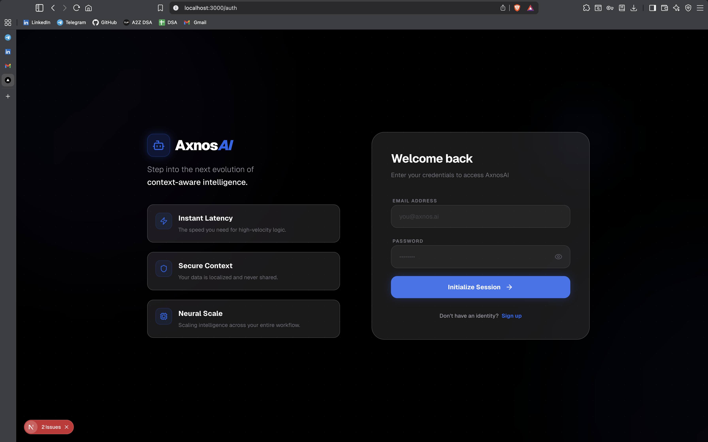
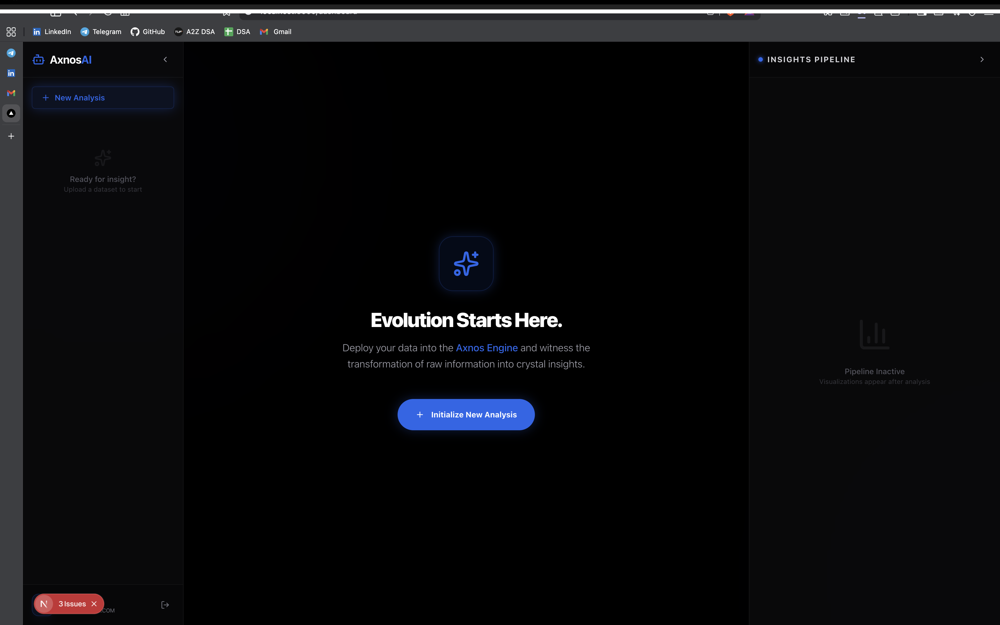
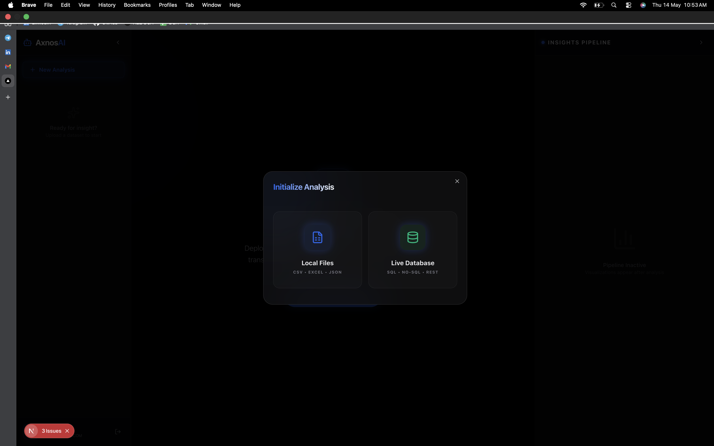
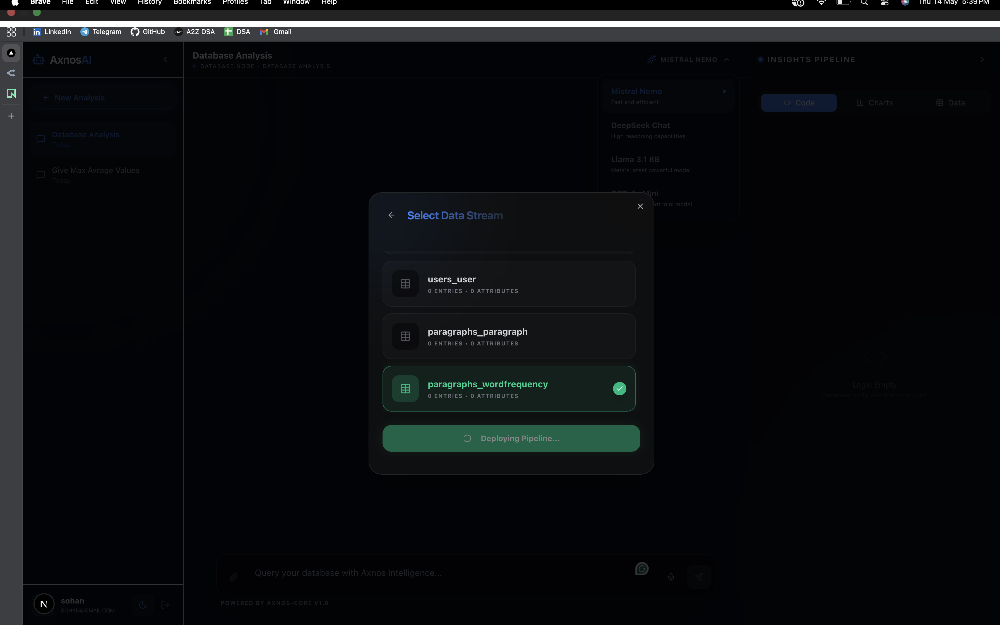
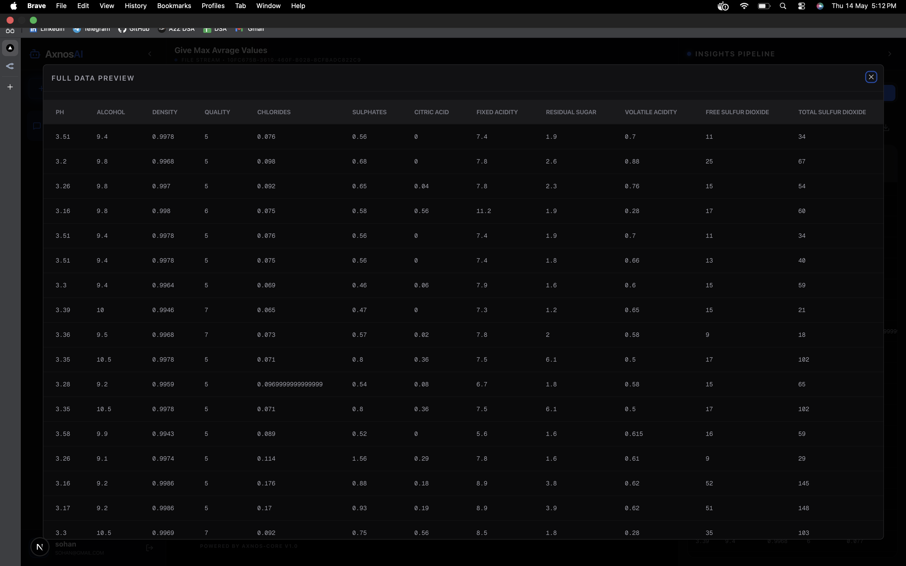
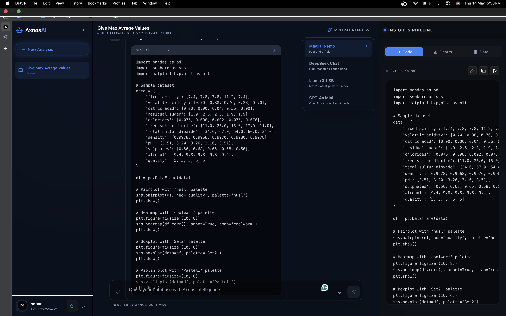
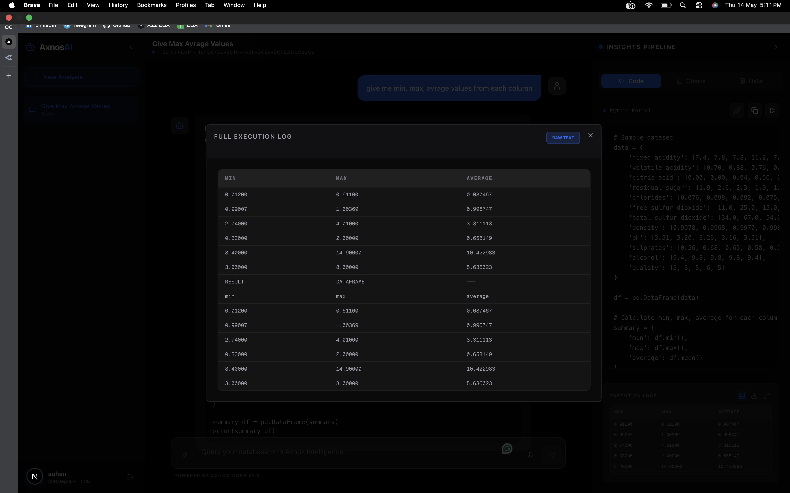
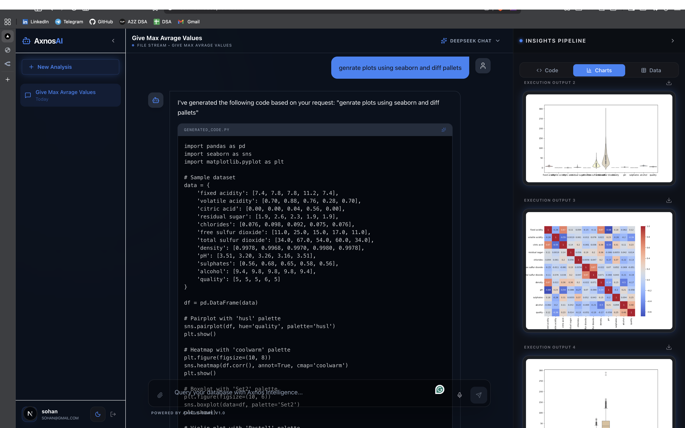

# AxnosAI Frontend 🎨

The sleek, intelligent user interface for the **AxnosAI** ecosystem. Built with Next.js 14, this dashboard provides a premium experience for data exploration and analysis.

> [!TIP]
> This is the frontend repository. For the core logic, API services, and orchestration, visit the [AxnosAI Backend Repository](https://github.com/aakashmohole/AxnosAI).

---

## 📸 Visual Walkthrough

### 1. Landing Page
The entry point to the AxnosAI ecosystem, featuring a modern, dark-themed design with smooth animations to introduce the platform's capabilities.


### 2. Login & Registration
Secure user authentication flow allowing users to create accounts and log in to access their private data analysis dashboard.


### 3. Dashboard
The central hub for all data operations, showing recent chats, connected data sources, and quick-start options.


### 4. Data Ingestion Options
Multiple ways to bring your data into AxnosAI, including file uploads (CSV, Excel) and direct database connections.


### 5. Live DB Connection
Connect directly to your SQL databases by providing a connection string. AxnosAI securely maps the schema for natural language querying.


### 6. Data Preview
Instant snapshot of your dataset, allowing you to verify the columns and data types before starting your analysis.


### 7. Code Generation
Witness the AI in action as it translates your natural language questions into precise, optimized Python/Pandas code.


### 8. Generated Output
Review the clean, executable code generated by the selected LLM before it's securely executed in an isolated environment.


### 9. Chart Generation
Transform data into visual insights. AxnosAI automatically generates plots and charts to help you visualize trends and patterns.


---

## ✨ Features

- **Interactive AI Chat**: High-performance chat interface with real-time streaming responses.
- **Dynamic Model Selection**: Switch between different LLMs (Mistral, DeepSeek, Llama, GPT) on the fly.
- **Data Visualization**: Integrated code blocks and automatic plot generation.
- **File & Database Integration**: Connect to various data sources seamlessly.
- **Voice-to-Text**: Built-in voice recognition for hands-free querying.

---

## 🛠 Tech Stack

- **Framework**: [Next.js 14 (App Router)](https://nextjs.org/)
- **Styling**: [Tailwind CSS](https://tailwindcss.com/)
- **Animations**: [Framer Motion](https://www.framer.com/motion/)
- **Icons**: [Lucide React](https://lucide.dev/)
- **State Management**: React Context API

---

## 🚀 Getting Started

### 1. Prerequisites
- Node.js 18+ 
- NPM / Yarn / Bun

### 2. Configuration
Create a `.env.local` file in the root directory:
```env
NEXT_PUBLIC_AUTH_API_URL=http://localhost:3001
NEXT_PUBLIC_PROXY_API_URL=http://localhost:8001
```

### 3. Installation
```bash
npm install
npm run dev
```

---

## 🐳 Docker Deployment

```bash
docker pull aakashmohole/axnos-frontend:latest
docker run -p 3000:3000 aakashmohole/axnos-frontend:latest
```

---

## 📝 License
MIT License. Part of the AxnosAI project.
